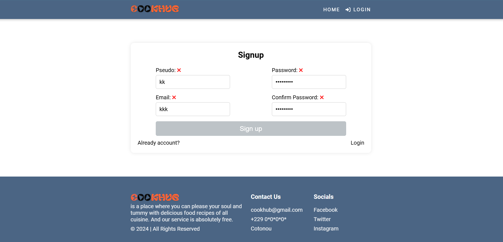

# CookHub (RecipeApp)

## Home Page

## Register Page


### Description

Cookhub est une application de gestion et de partage de recettes développée en React. Elle permet 
aux utilisateurs de créer, consulter, liker, télecharger et ajouter des recettes à leurs favoris.

### Prérequis 

Avant de démarrer le projet assurez-vous d'avoir 
les éléments suivant installés: 

- Node.js(version >= 14.x)
- npm ou yarn

### Installation du Front

Clonez le dépot et installez les dépendances : 

```bash
git clone https://github.com/Mardino229/RecipeApp.git
cd recipeapp
npm install
```
### Démarrage de l'application

```bash
npm run dev
```
### Installation du back 

Suivez ce [lien](https://github.com/Mardino229/RecipeAppBack) pour installer et configurer le back de l'application

### Configuration du front

- Accéder au fichier index.js dans le repertoire src/constants

- Rechercher la variable BASE_URL et mettez le lien du backend

## Technologies utilisées 
 - React
 - Vite
 - Axios (pour les requêtes HTTP)

## Fonctionnalités

 - Créez, modifier, partager et supprimer des recettes.
 - Voir les recettes des autres utilisateurs via un fil d'actualité 
 - Filtrer les recettes par nom
 - Ajouter des recettes aux favoris
 - Liker des recettes
 - Télecharger vos recettes préférés sous format PDF
 - Gestion des utilisateurs et authentification

Consultez mon portfolio [ici]() 😊😜😏


